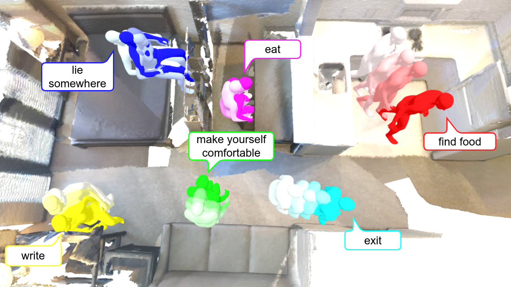

# GHOST: Grounded Human Motion Generation with Open Vocabulary Scene-and-Text Contexts

### Zoltán Á. Milacski¹, Koichiro Niinuma², Ryosuke Kawamura², Fernando de la Torre¹, László A. Jeni¹

¹ Robotics Institute, Carnegie Mellon University, Pittsburgh, PA, USA  
² Fujitsu Research of America, Pittsburgh, PA, USA  

  
This repository provides the **official implementation** of: **"GHOST: Grounded Human Motion Generation with Open Vocabulary Scene-and-Text Contexts"**, a novel approach for **generating human motion in 3D scenes** based on **spatially-grounded text descriptions**. 


## 🔥 Motivation & Problem Definition
GHOST generates **grounded human motion** in 3D environments, driven by **open-vocabulary** spatial text descriptions.
### ✨ Key Challenges:
- **Aligning text and scene** representations for accurate grounding.
- **Identifying and localizing the goal object** within the scene from spatial text references.
- **Modeling realistic human-goal object interactions** within complex environments.

---

## 🚀 Our Approach: GHOST  
GHOST introduces a **two-stage framework** to improve scene-text alignment and motion placement:

🔹 **Step 1: Pretraining**
- The **scene encoder** is pretrained to map each 3D scene point (from a point cloud) to **CLIP space**.
- We achieve this by aligning the scene encoder with a **2D open-vocabulary image segmentation model** using the OpenScene loss.


🔹 **Step 2: Training**
- The **motion generator (cVAE)** is trained using both **scene point cloud** and **text embeddings**.
- We apply **regularization losses** to enhance **goal-object grounding**.
- The **scene encoder** is fine-tuned, while the **text encoder remains frozen**.


### 🎯 Key Benefits  
✅ **Good Initialization for Grounding**: Pretrained and fine-tuned scene-text alignment in CLIP space, as opposed to training from scratch on the limited-sized HUMANISE dataset.

✅ **Enhanced Goal Object Awareness**: Regresses both bounding box and category for better object localization, compared to regressing only the object center.

✅ **Plug-and-Play Framework**: Compatible with current and future **2D open-vocabulary image segmentation models** as the **pretraining teacher model**.

✅ **Zero-Shot Generalization**: Handles open-vocabulary text inputs, even though training is limited to template-based text data.

---

## 📊 Experimental Results  
GHOST consistently outperforms **HUMANISE cVAE**.

### **Quantitative Results**

✅ **Consistent improvement across all three teacher models**.

✅ **Up to 30% improved motion placement** (closer to goal objects).

✅ **Lower average pairwise distance** (more clustered motions).

✅ **Unanimous human preference** in perceptual user studies.

| Model  | Goal Object Distance ↓ | Avg. Pairwise Distance ↓ |
|----------------------------|------------------------|--------------------------|  
| HUMANISE cVAE  | 1.008m  | 11.83m  |
| **GHOST LSeg (Ours)**  | 0.748m  | **9.54m**  |  
| **GHOST OpenSeg (Ours)**  | **0.732m**  | 9.80m  |  
| **GHOST OVSeg (Ours)**  | 0.767m  | 10.08m  | 

---

| Model                      | # of Humans Preferring ↑ | Total Preference % ↑         |  
|----------------------------|------------------------|--------------------------|  
| HUMANISE cVAE              | 0                      | 36.73%                   |  
| **GHOST OpenSeg (Ours)**   | **27**                 | **63.27%**               |  

---

### **Qualitative Results**

✅ **No bias towards scene center**.

✅ **Zero-Shot Generalization** capability.


| **HUMANISE cVAE** | **GHOST OpenSeg (Ours)** | **GHOST OpenSeg Zero-Shot (Ours)** |
-----------------------------|-----------------------------|-----------------------------|
|  |  |  |


---

## 🛠️ Implementation Details
- **Dataset**: [**HUMANISE**](https://github.com/Silverster98/HUMANISE) (19,648 [AMASS motions](https://amass.is.tue.mpg.de/), 643 [ScanNet V2 scenes](http://www.scan-net.org/), [Motion-scene alignments](https://docs.google.com/forms/d/e/1FAIpQLSfzhj2wrRLqAXFVOTn8K5NDN-J_5HueRTohMAlayqBuPPWA1w/viewform?usp=sf_link), [SMPL-X parameters](https://smpl-x.is.tue.mpg.de/download.php), 4 actions: walk, sit, stand up, lie)
- **Model**:  
  🏗 **Student 3D Scene Encoder**: Point Transformer U-Net
  
  🏗 **Teacher 2D Open-Vocabulary Image Segmentation Encoder**: LSeg, OpenSeg, OVSeg

  🏗 **CLIP Text Encoder**: ViT-B/32, ViT-L/14@336px, and ViT-L/14
- **Hardware**: NVIDIA A100 (80 GB)

---

## 🚀 Installation & Usage
### **Requirements**
```bash
pip install -r requirements.txt
```
python, pytorch 1.10 and cuda11.3.

### Pretrained Models

## Citation
If you find our project useful, please consider citing us:

```bibtex
@article{milacski2024ghost,
  title={GHOST: Grounded Human Motion Generation with Open Vocabulary Scene-and-Text Contexts},
  author={Milacski, Zolt{\'a}n {\'A} and Niinuma, Koichiro and Kawamura, Ryosuke and de la Torre, Fernando and Jeni, L{\'a}szl{\'o} A},
  journal={arXiv preprint arXiv:2405.18438},
  year={2024}
}
```

## Acknowledgements
This research was supported partially by Fujitsu. Implementation is based on the original [HUMANISE GitHub repository](https://github.com/Silverster98/HUMANISE)

### License
Our code and data are released under the [MIT license](./LICENSE). The following datasets are used in our project and are subject to their respective licenses:

- [HUMANISE is under the MIT license](https://github.com/Silverster98/HUMANISE).
- [AMASS is under the Dataset Copyright License for non-commercial scientific research purposes](https://amass.is.tue.mpg.de/license.html).
- [BABEL is under the Software Copyright License for non-commercial scientific research purposes](https://babel.is.tue.mpg.de/license.html).
- [ScanNet V2 is under the ScanNet Terms of Use](http://kaldir.vc.in.tum.de/scannet/ScanNet_TOS.pdf).
- [Scan2Cad is under the Creative Commons Attribution-NonCommercial-ShareAlike 3.0 Unported License.](https://github.com/skanti/Scan2CAD/blob/master/LICENSE.txt)
- [ReferIt3D is under the MIT license](https://github.com/referit3d/referit3d/blob/eccv/LICENSE).
